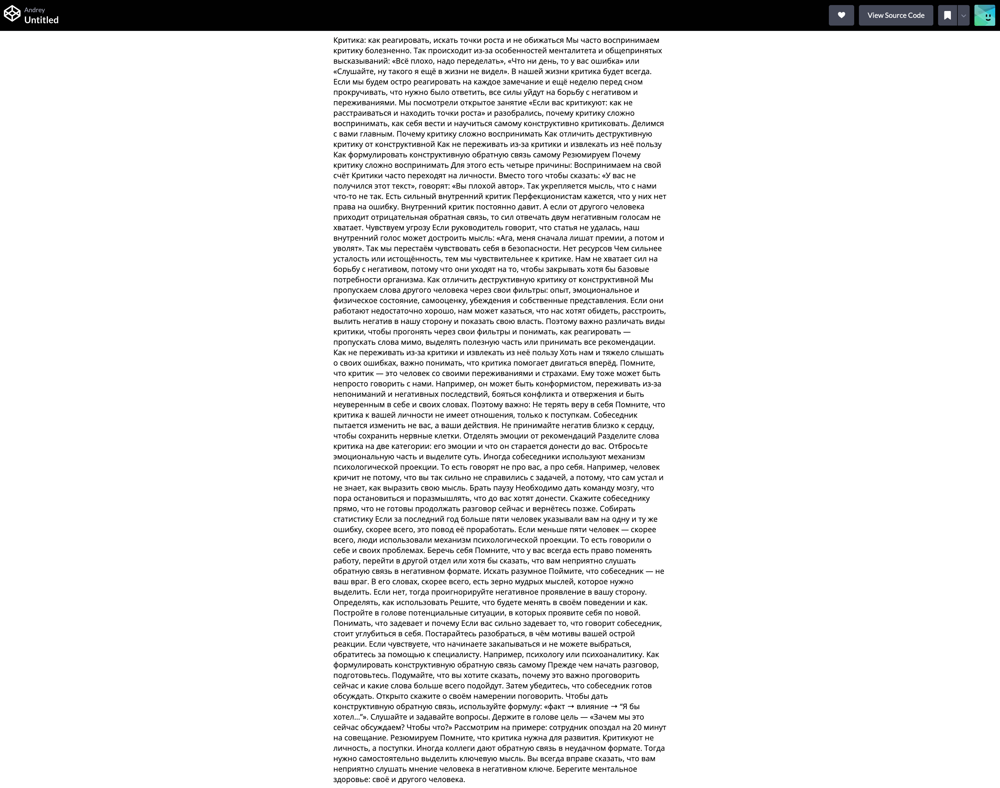
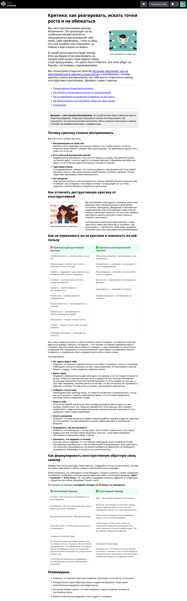

# Вёрстка статьи «Критика: как реагировать, искать точки роста и не обижаться» для сайта

### Реализация

**В песочнице CodePen.** Перед началом работы сделайте форк пена на [странице](https://codepen.io/Traktaran/pen/yyYZYMg).

**Важно.** Общую структуру документа создавать не надо, вкладка CodePen «HTML» работает, как тег `<body>`.
Изучите [инструкцию по работе с CodePen](https://github.com/netology-code/guides/tree/master/codepen).

Редактор CodePen больше недоступен в РФ. Если вы не можете сделать задание в нём, то предлагаем вам альтернативное решение - JS Bin. Создайте аккаунт, перенесите стили из репозитория GitHub и выполняйте задания в JS Bin. [Подробная инструкция](https://github.com/netology-code/guides/tree/master/jsbin)

---

## Описание

После собеседования в одной известной компании вы получили на почту тестовые задания. И первое из них &mdash; это создание статьи для сайта «Критика: как реагировать, искать точки роста и не обижаться». У вас есть только текст, который выглядит так:

Итоговая вёрстка должна соответствовать макету и выглядеть следующим образом:

## Процесс реализации

1. Найдите в тексте все заголовки и оберните соответствующими тегами.
2. Абзацы (параграфы) текста разметьте соответствующим тегом.
3. Найти в тексте списки и сделать их соответствующими тегами. Нумерованные и ненумерованные списки делать путём использования соответствующих тегов, без использования css. 
4. Найти в тексте ссылки и сделать их соответствующим тегом. 
5. Найти в тексте все цитаты _«Всё плохо, надо переделать»_ и обернуть их соответствующим тегом, без использования css. 
6. Жирный текст, не являющийся заголовками, обернуть необходимым тегом для придания жирности без использования css. 
7. Цитату "Критика — это топливо для развития. Но иногда коллеги..." обернуть тегом blockquote
8. Вставить на страницу два изображения с таблицами. Использовать ссылки на изображения: [изображение](img/img-table-first.png) и [изображение](img/img-table-second.png). Так же изображениям добавить альтернативный текст. 
9. После первого заголовка "Критика: как реагировать, искать точки роста и не обижаться" добавьте элемент `figure`. Внутри элемента `figure` добавьте изображение. В качестве источника изображения используйте [изображение](img/figure-first.jpg). Для изображения добавьте альтернативный текст. Создайте подпись к элементу `figure` с текстом «Как реагировать на критику?». 
10. После заголовка "Как отличить деструктивную критику от конструктивной" добавьте второй элемент `figure`. Внутри элемента `figure` добавьте изображение. В качестве источника изображения используйте [изображение](img/figure-second.png). Для изображения добавьте альтернативный текст. Создайте подпись к элементу `figure` с текстом «Фильтруй критику правильно». 
11. Добавьте css на страницу. Для элемента figure установите внутренний отступ со всех сторон 18px, сплошную рамку шириной 2px и цветом #e0e4e8, внешний отступ сверху и снизу 20px. Для элементов `figure` задайте персональные классы. Первый элемент `figure` расположите как показано в макете и задайте ему внешний отступ слева `40px`, справа — `0`. Второй элемент `figure` расположите как показано в макете и задайте ему внешний отступ слева `0`, справа — `40px`.
12. Для элементов figcaption через css задайте выравнивание текста по центру, размер шрифта `14px`, высоту строки `16px` и внешний отступ снизу `10px`. 
13. Для элементов абзацев (параграфов) через css задайте размер шрифта 16px и высоту строки `1.2`. 
14. Для элемента blockquote задайте внешние отступы сверху и снизу по `20px`, слева и справа `0`, внутренние отступы по всему периметру `20px`, фоновый цвет `#eee`, стиль текста `italic`.
15. Реализовать якорные ссылки для навигации по странице. У первого списка на странице есть ссылки. Эти ссылки соответствуют заголовкам на странице. Необходимо реализовать якорные ссылки к соответствующим заголовкам. 

